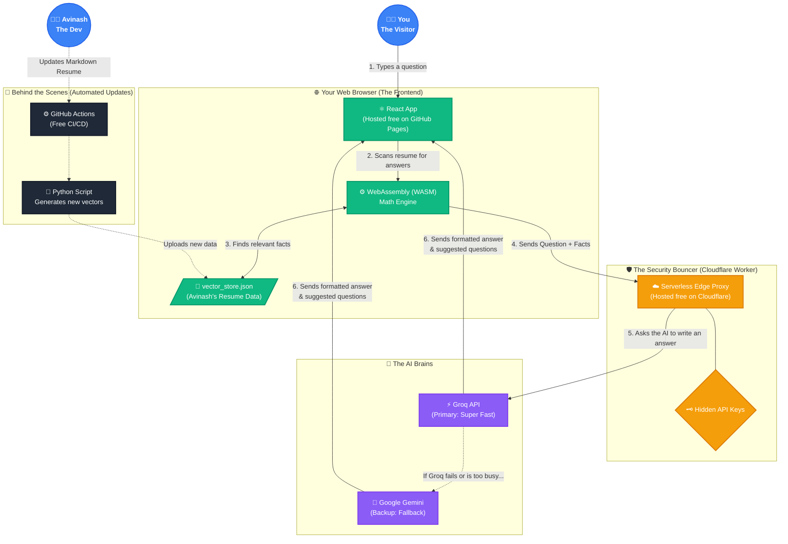

# 🏛️ How This AI Portfolio Works (For Beginners)

Welcome! If you're wondering how this AI portfolio operates for **$0/month** without ever crashing, you're in the right place. 

Most AI apps require expensive servers (like AWS EC2) and paid databases (like Pinecone). This project uses a **Serverless Retrieval-Augmented Generation (RAG)** architecture. That sounds complicated, but it's actually just a clever way of making the user's browser do the heavy lifting!

Here is the complete flowchart of what happens when you type a question:

---

## 📖 Breaking it down step-by-step:

### 1. The User Asks a Question
When you visit the site, you are downloading a static React website hosted entirely for free on GitHub Pages. You type: *"What did Avinash do at Zoho?"*

### 2. The Browser Does the Math (`Client-Side Vectors`)
Normally, apps send your question to a paid database to find relevant resume facts. **We don't do that.** 
Instead, we download a small JSON file containing Avinash's entire resume pre-calculated into "vectors" (numbers). A tiny math engine called WebAssembly runs directly *inside your browser* to find the right facts instantly. It's free, completely private, and lightning fast.

### 3. The Cloudflare Security Bouncer (`The Edge Proxy`)
Now we have your question + the facts from the resume. We need to send this to an AI (like ChatGPT) to write a nice response. 
However, we can't put secret API keys in the frontend, or hackers will steal them! Instead, the browser sends the data to a **Cloudflare Worker**. This is a tiny piece of code living on the internet that securely holds the API keys, attaches them to the request, and forwards it to the AI.

### 4. The Uncrashable AI (`High-Availability Fallback`)
The Cloudflare Worker asks **Groq** (an incredibly fast AI model) to generate the answer. 
But what if millions of people visit the site and Groq gets overwhelmed? The Cloudflare Worker is smart: if Groq fails, it instantly redirects the question to **Google Gemini** as a backup. The user never sees an error, and the chat never goes down.

### 5. Automated Updates (`CI/CD Pipeline`)
How does Avinash add new skills to his resume? Does he have to code new math vectors? **No.**
He simply edits a standard Markdown text file on GitHub. The moment he hits "Save", a GitHub Action (a free robot) wakes up, runs a Python script to recalculate all the math, rebuilds the website, and deploys it to the internet automatically. 

**Summary:** By making the user's browser do the heavy lifting and using smart, serverless edge networks, this site achieves enterprise-level AI capabilities for $0.

---
## ?? AI Context & Repository Navigation
*This section provides unified context for AI agents (like Claude, Copilot, Cursor) and developers to seamlessly navigate the codebase.*
- **[Main Project Overview](/README.md)**: Entry point, feature list, and quick start.
- **[Beginner Architecture Guide](/ARCHITECTURE.md)**: Visual Mermaid flowchart of the $0 Serverless RAG pipeline.
- **[Technical Architecture Diagram](/serverless_rag_architecture.md)**: Deep dive into the Cloudflare/WASM stack.
- **[Frontend Documentation](/frontend/README.md)**: React, Vite, and Client-Side Vector search setup.
- **[Backend Documentation](/backend/README.md)**: Cloudflare Worker Edge Proxy and Python CI/CD pipeline.
- **[Resume Knowledge Base](/backend/pipeline/data/avinash_data.md)**: The Markdown source-of-truth containing the portfolio data.
