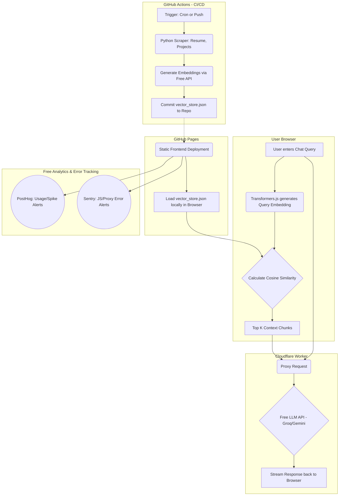

# Zero-Cost, Scalable Serverless RAG Portfolio Blueprint

To build a highly scalable, secure, and zero-downtime RAG (Retrieval-Augmented Generation) portfolio entirely for free, you must break away from traditional server architectures. By shifting the workload to GitHub Actions for processing, the user's browser for querying, and Cloudflare Workers for secure API routing, you can achieve a 100% free Serverless RAG pipeline.

## The Architecture: Static RAG

Instead of querying a live database, your portfolio will rely on a static vector store and edge computing.

### 1. The Database & Pipeline (GitHub Actions)
You do not need a paid vector database like Pinecone. Your database will simply be a `vector_store.json` file hosted alongside your website.
* **The Worker:** Write a Python script that parses your resume, blog posts, and project READMEs. 
* **The Automation:** Set up a GitHub Actions workflow that runs on a cron schedule (e.g., once a week) or triggers whenever you push a new project to the main branch. 
* **The Process:** The Action runs the Python script, chunks your text, generates vector embeddings using a free API (like the Gemini API free tier), and saves the results to `vector_store.json`. The Action then automatically commits this updated JSON file back to your repository.

### 2. The Client & Retrieval (GitHub Pages)
Your frontend (React, Vue, or vanilla HTML) is hosted on GitHub Pages, which provides zero-downtime static hosting globally for free.
* **The Load:** When a user visits your portfolio, the site statically loads the `vector_store.json` file.
* **Client-Side Embedding:** When a user asks a question, use a library like `Transformers.js` (WebAssembly) to generate the embedding for their query **directly in their browser**.
* **Local Search:** Write a simple JavaScript function to calculate the cosine similarity between the user's query embedding and your downloaded `vector_store.json`. This instantly retrieves the most relevant chunks of your portfolio without needing a backend server.

### 3. The LLM Generation & Security (Cloudflare Workers)
You should never put an LLM API key in your frontend code (GitHub Pages).
* **The Proxy:** Set up a Cloudflare Worker (the free tier allows 100,000 requests per day).
* **The Handshake:** Your GitHub Pages frontend sends the user's query and the relevant context chunks to your Cloudflare Worker.
* **The Generation:** The Worker securely holds your LLM API key (e.g., Groq or Gemini) as a secret environment variable, forwards the prompt to the AI, and streams the response back to your portfolio. Cloudflare Workers execute at the edge, meaning they scale instantly from zero to millions with no server management.

---

## Architecture Diagram

Below is the Mermaid flowchart visualizing how data flows through this serverless pipeline:

---

## Observability & Reporting 

To monitor spikes and catch errors for free, integrate these tools into your GitHub Pages frontend:

* **Traffic & Usage Spikes (PostHog):** PostHog offers a generous free tier. It will track how many people are using your RAG chat, record what they are asking, and alert you if usage suddenly spikes.
* **Error Tracking (Sentry):** Sentry provides a developer free tier. If `Transformers.js` fails on a specific browser, or if your Cloudflare Worker returns a 500 error, Sentry will instantly email you the stack trace.
* **Pipeline Monitoring (GitHub Actions):** GitHub Actions automatically sends an email notification if your scheduled `vector_store.json` update pipeline fails, ensuring your knowledge base is never silently broken.

By relying on static files, browser compute, and edge proxies, this setup is completely immune to traditional server crashes, costs exactly $0, and scales infinitely.
---
## ?? AI Context & Repository Navigation
*This section provides unified context for AI agents (like Claude, Copilot, Cursor) and developers to seamlessly navigate the codebase.*
- **[Main Project Overview](/README.md)**: Entry point, feature list, and quick start.
- **[Beginner Architecture Guide](/ARCHITECTURE.md)**: Visual Mermaid flowchart of the $0 Serverless RAG pipeline.
- **[Technical Architecture Diagram](/serverless_rag_architecture.md)**: Deep dive into the Cloudflare/WASM stack.
- **[Frontend Documentation](/frontend/README.md)**: React, Vite, and Client-Side Vector search setup.
- **[Backend Documentation](/backend/README.md)**: Cloudflare Worker Edge Proxy and Python CI/CD pipeline.
- **[Resume Knowledge Base](/backend/pipeline/data/avinash_data.md)**: The Markdown source-of-truth containing the portfolio data.
